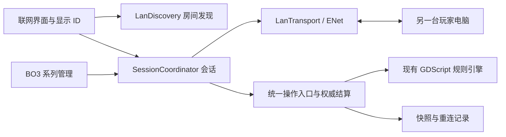

# 局域网联机方案

本次增量更新以[卡组分享、观战与回放](卡组分享、观战与回放.md)为准：`.mdeck` 与 `.mreply` 位于 EXE 同目录；观战使用对战端口加1；断线30秒改为整场判掉线方负。

日期：2026-09-20。状态：multicolor:arena 1.0 已实现联机、单局投降与双方延迟显示；首局投骰及局间败者选择先后手已接入，等待真实双机验证。

## 1. 确定采用的方案

采用 **Godot 原生 ENet 直连 + UDP 房间发现 + 房主统一结算**。一台电脑创建房间，同时作为玩家和规则权威端；另一台电脑加入。同一可互通的局域网内不需要平台账号、中继服务器、公网 IP 或路由器端口映射。

Godot 提供 ENetMultiplayerPeer 的建服与连接接口；ENet 使用 UDP。官方文档也明确说明局域网客户端可通过内网地址连接主机。[ENetMultiplayerPeer](https://docs.godotengine.org/en/stable/classes/class_enetmultiplayerpeer.html)、[Godot 局域网连接说明](https://docs.godotengine.org/en/stable/tutorials/networking/high_level_multiplayer.html#hosting-considerations)

此方案用于同路由器、可互通 Wi-Fi/有线网络等场景，也可通过提供通用UDP互通的虚拟局域网跨不同网络使用IP加入，见[虚拟局域网异地联机](虚拟局域网异地联机.md)。此前的[平台中继方案](联网对战方案.md)保留为后续集成方向。局域网发现码不能当作公网房间码。

## 2. 玩家看到的流程

1. 打开“联网对战”，进入局域网页面，编辑显示 ID。
2. 房主点击“创建房间”，选择 BO1 / BO3、卡组检查设置。
3. 另一位玩家点击自动刷新的房间列表，房主接受加入申请；握手检查规则版本，不公开卡组内容。
4. 双方选择卡组并准备，首局双方投 D6，平点重投，点数高者自行选择先手或后手；BO3 后续局由上一局败者选择，平局沿用上一局选择者。选定后开始游戏。房间满员后停止接受新玩家，仍允许原席位重连。

发现不到房间时，提供“输入地址加入”作为备用。房主页面显示内网地址和端口，玩家不必去命令行寻找。创建房间时可选绑定地址，通常保留“所有网卡”。

首次创建房间，Windows 可能要求允许游戏在专用网络通信。游戏只说明这一步，不自动修改系统防火墙。访客 Wi-Fi、AP 隔离或不同 VLAN 可能不允许设备互通；如果只是广播被禁而单播互通，输入地址仍能连接。手机热点需要实际检查是否允许客户端之间通信，不承诺所有热点都可用。

## 3. 发现与传输

LanDiscovery 使用 PacketPeerUDP，LanTransport 使用 ENetMultiplayerPeer。两者独立：发现服务坏了不影响已建立的对局。PacketPeerUDP 支持启用广播、接收来源地址和指定绑定地址。[Godot UDP API](https://docs.godotengine.org/en/stable/classes/class_packetpeerudp.html)

发现端口为 UDP 47860，对局默认端口 UDP 47861，可在建房页面修改。创建失败时显示错误，不自动结束其他程序。正式对局端口变化时随房间广播发布。首版以 IPv4 局域网为目标，IPv6 与复杂跨子网发现不列为首版保证。

房主监听发现端口；加入端在临时本地端口发送广播查询，房主单播回复到查询来源端口。这样加入端无需和房主争用同一个监听端口，也便于同机双开测试。约每秒查询一次、5 秒未收到回复的房间从列表移除；关闭房间立即停止发现。多网卡按选定接口发送，跨子网采用地址加入。主线程轮询收包，不能使用会阻塞界面的无限等待。

发现消息只有产品标识、发现协议版本、随机 room_id、房间昵称、端口、BO1/BO3、人数、状态、规则版本摘要。严格限制长度，忽略未知产品与错误字段。来源 IP 取实际收到的 UDP 数据报，不接受对方在正文中自报任意地址。短码是房间列表的便捷标识；重名或冲突以完整 room_id 区分。

ENet 建服只允许一位远端玩家。可靠有序通道承载操作、事件、确认和快照；心跳与连接状态走独立通道。大快照按 snapshot_id 分块、校验和重组，不能因为一次大的恢复传输使心跳误判断线。应用层仍保留命令去重和事件序号，不能把 ENet 重传当作断线后的状态恢复。

## 4. 身份、结算与隐私

连接前可修改的 ID 仍是昵称。局域网身份无需平台账号：本地保存随机安装标识，房主在入房后分配固定席位和独立随机恢复令牌。新的网络 peer_id 不等于新席位；重连必须验证原 match_id、seat_id 和恢复令牌，不能靠相同昵称接管玩家。令牌不加入房间广播或流程记录。

首次加入由房主确认玩家；版本、规则库和房间设置一致后才能准备。游戏采用受信任好友之间的房主模型，房主拥有完整状态，不宣称能防止恶意房主查看隐藏牌。普通 ENet 传输也不在本方案中被声称为已加密链路；若后续需要保护公共网络上的传输，应在 TransportAdapter 内增加经验证的加密传输，不能自制简单混淆当作加密。

客机只发送操作请求，房主检查是否合法并计算结果；双方显示房主提交后的状态。骰子、洗牌、先制伤判、触发入堆叠和比分只由权威端执行一次。玩家手牌、牌库顺序和可选隐藏目标按席位裁剪，禁止把完整 engine.players 或原始展示事件直接广播。

本轮的新付款方式也属于私有声明：金边推荐、点击取消和蓝边替换均留在本地；直到点“发动”才发送最终资源、颜色和目标。房主一次校验并原子提交，取消不会发送使用动作，重复提交不会重复扣费。已经公开入堆叠的触发选择按待决状态恢复，不能撤销成从未发动。

## 5. 重连、BO3 与状态恢复

沿用平台中继设计的 CommandGateway、RulesAuthority、SeatProjection、JournalStore 和 SeriesController。两条网络路径只替换房间发现、身份提供者和传输适配器。

心跳每 2 秒，连续约 6.5 秒无消息或收到断线事件后进入断线等待。检测到后立即锁住操作并显示30秒倒计时，可以查看战场、预览和公开区域，隐藏牌仍保密。期限内自动重试，完成身份、版本与快照确认后继续；重复失败不会重置期限。满30秒未恢复则终止整场BO3，不追加胜负，不再接受行动或恢复这场对局。房主与客机独立执行相同超时策略，因此房主掉线时客机也会结束等待。

房主地址改变时，填写新地址后点击“重连上次房间”，继续校验原 room_id 与恢复令牌，不能把另一个房间误认作原对局。房主进程重启依赖原子保存的快照；文件丢失或房主永久退出则本局中断。首版不自动迁移房主。

快照覆盖堆叠、待选目标、触发顺序、先制/普通伤判状态、延迟效果、使用次数、所有区域与指示物、随机状态、单局与 BO3 信息。私有付款预留可取消后重选；已确认付款必须恢复为已经付过。每个 game_id 的结果只计分一次。

BO3 先取得两场胜利；投降只结束当前单局，未分出系列胜者时点“下一局”进入准备；局间换备牌采用图形编辑器，左侧预览、中央主副牌区沿用组卡器，右侧不显示牌库。点击卡片或拖动在主副卡组间移动，右键只预览；自机及登记总牌池锁定。编辑时可临时腾挪超出副卡组数量，点击“更换完成”时按房间设置校验主卡组、同名限制、副卡组上限、固定自机和登记牌池，房主确认后返回准备页。未完成返回不提交；已准备可取消准备后修改。首局投点与每局先后手选择由房主持久化并同步，重连不重投或重选；平局不计胜场，不提供整场认输入口。双方在房间查看卡组检查设置后准备，重连保留原设置。

房间和战场显示双方RTT。connection_metrics.gd通过心跳探针与回执测量本机单调时钟的往返差值，交换双方各自测量结果，约每2秒更新。过期显示“测量中”，断线清空并显示“已断开”。延迟信息不进入规则快照、不增加操作序号，也不重建选牌界面。

## 6. 已落地模块与验证

连接与发现独立为 net/lan_transport.gd、lan_discovery.gd，身份为 local_identity.gd。lan_session.gd 协调会话、确认、去重和恢复；command_gateway.gd 负责白名单操作与合法性；seat_projection.gd 裁剪可见状态；remote_duel.gd 为双方界面提供只读状态和提交入口；state_codec.gd、journal_store.gd 保存完整规则状态及共享引用；series_controller.gd 管理 BO1/BO3。卡牌效果不调用 ENet。显示层映射本机席位，不交换引擎玩家数组。

联机对局禁止调试移动，房主同时拒绝对应协议指令。恢复记录使用带校验的原子替换和上一代备份；若旧备份早于客机已确认操作，拒绝静默倒退。付款草稿保持私有，准备操作不计作有效提交。公网平台中继仍未接入，后续替换传输和房间服务，保留权威结算与席位裁剪。

验收必须使用两台独立电脑，包括同路由器有线、同 Wi-Fi、Wi-Fi/有线混用以及可互通热点；另测广播被禁时的地址加入。两台不连接互联网仍应完成发现、开局与一场对战。相同程序版本、不同显示分辨率/帧率应得出同一权威结果。

故障用例包含错误版本、房间已满、端口占用、重复昵称、断线10秒内恢复／超过30秒终止、付款提交前后断开、触发目标未选时断开、先制伤判之间断开、胜负计分时重连，以及房主进程恢复。确认不双付、不重掷、不重复计分、不泄露未公开卡牌。首次本地连接应以几次点击完成，地址输入作为备用而非默认流程。

本机两个独立 Godot 进程已通过 ENet 完整进行一局预组对战，双方在第17回合收到一致胜负、生命和序号。另通过发现、确认入房、重连、BO3计分、换备牌限制、待选触发恢复、付款取消与发行版资源检查。自动测试临时监听在结束时关闭，未修改防火墙。真实两台电脑的网络、防火墙和分辨率组合尚待验证，操作步骤见[局域网双机测试](局域网双机测试.md)。
