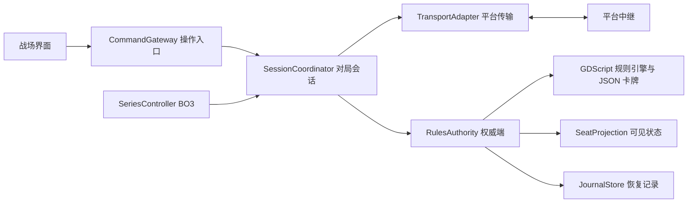

# 联网对战方案 · 平台中继与房主统一结算

日期：2026-09-20。状态：设计方案，尚未接入联网。依据本轮确认，BO3、连接前修改 ID、重连与平台接入均只做方案；本轮实际游戏改动仅为堆叠显示。

局域网模式另见 [局域网联机方案](局域网联机方案.md)：采用原生 ENet 直连和 UDP 房间发现，无需平台账号；与本文公网中继共用结算、恢复和 BO3 模块。

## 1. 推荐结论

采用“平台托管中继 + 房间码加入 + 房主权威结算”。两台玩家电脑互为对等端，数据经平台转发；房主运行唯一的规则引擎，另一端提交操作并接收结果。保留当前 GDScript 规则引擎与 JSON 卡牌库。将来改成专用服务器时，迁移权威端的位置，卡牌效果不依赖平台 API。

按目前直接分享 Windows 压缩包的发行方式，首选验证 EOS（Epic Online Services）的 P2P 中继与大厅服务。采用强制中继方向，不要求玩家设置路由器、转发端口、输入公网 IP 或安装虚拟局域网。EOS 官方列出了 P2P、大厅等模块，并说明可用于不同引擎和商店。[EOS 官方服务说明](https://onlineservices.epicgames.com/)

EOS 提供 ForceRelays 模式；接入时在原生 SDK 适配器中设置，并通过连接诊断确认实际走中继。官方发布说明可核对该模式，文中的 Unreal 配置写法不能直接复制到 Godot。[Epic 官方发布说明，Online 一节](https://dev.epicgames.com/documentation/ja-jp/unreal-engine/unreal-engine-5.2-release-notes?application_version=5.2)

| 路线 | 适合程度 | 本项目决定 |
| --- | --- | --- |
| EOS 中继 + 大厅 | 符合跨商店、独立压缩包方向；仍需验证 Godot 原生桥接和国内实际线路 | 首选技术验证对象 |
| Steam SDR + Steam 大厅 | 适合已有 Steam 发行与身份体系；非 Steam 使用有资格和接入条件 | 以后确定 Steam 发行时可替换适配器 |
| 自建 WebRTC + TURN | 需要维护信令、中继、线路和容量 | 不作为本轮首选 |

Steam 官方说明：非 Steam 平台使用 SDR 要满足包括已有 Steam 发行版本等条件；开源 GameNetworkingSockets 本身不提供 Valve 中继网络访问。因此不能把随意分发的 EXE 当作已获得 Steam 中继服务。[Steam SDR 官方要求](https://partner.steamgames.com/doc/features/multiplayer/steamdatagramrelay?l=english)

平台中继只负责传输，不替游戏计算伤害、保存 BO3 进度或实现断线续局。上述游戏状态仍由我们实现。EOS 是首选接入候选，并未完成双机验证；跨中国的稳定性不能用服务名称代替实测。

## 2. 玩家流程与身份

进入“联网对战”后先编辑显示 ID，再选择创建房间或加入房间。房主选择 BO1 / BO3、卡组检查开关，创建后得到可复制的房间码；另一方粘贴加入。双方选好卡组并准备后开始。所有操作仍集中在游戏内，连接参数由适配器处理。

显示 ID 是昵称，可在连接前修改并本地保存；不作为账号、席位或重连凭证。内部使用平台验证身份、固定席位与不公开的恢复令牌。整场系列赛沿用准备时的昵称，避免断线改名被误认成新玩家。

免额外账号操作是接入验收目标，优先验证 EOS Connect 的设备身份方案。当前尚未在本项目验证 Device ID 的首次创建、重启恢复及发布配置，不能把“无需 Epic 账号登录”当作已经完成的功能。如果实际要求玩家额外登录，需在正式接入前明确告知。开发者需设置平台产品、部署环境和客户端权限；本轮没有创建平台项目、安装 SDK 或使用任何账号。

房间发现由独立的 LobbyDirectory 负责：短码映射到真正的 lobby/session ID；重复短码重新生成；搜索有多个结果或房间已失效时不盲目加入。入房握手检查产品、版本、席位和对端身份。短码是邀请方式，不能替代身份验证。房间锁定后仅允许原席位重连。首轮验证需确认所选平台的大厅检索、公开范围和短码映射限制。

## 3. 一致结算与隐藏信息

房主是唯一有权提交规则变化的一端。客机仅发“使用此牌、指定这些目标、用这些颜色付费、放弃响应”等操作请求，不发送“对手扣 3 血”的结果。房主重新检查执行权、区域、目标、支付、次数与版本，接受后统一结算、编号、记录，并向双方发布各自可以看到的事件与状态。

这样显卡、帧率、窗口大小和动画速度不参与规则计算。双方不用各自掷骰、各自洗牌再期望结果相同。随机结果由权威端生成一次，已经发生的公开结果进入事件日志；牌库顺序与未公开随机状态不发送给对手。规则仍可能存在双方共同遇到的软件错误，这套架构解决的是两端各算各的分歧，不宣称能消除所有规则 bug。

一个请求包含 protocol_version、match_id、game_id、固定 seat_id、command_id、所依据的 revision、具体参数。席位最终取自已认证连接而非信任报文。收到重复 command_id 只返回原结果，不再次付款或结算；过期请求重新验证，失去执行权或目标失效时拒绝并同步最新状态。

每批提交产生递增 event_seq 和新 revision。事件、快照、确认回执都包含所属对局和版本。缺号先补发，补发范围不足则发快照；旧对局报文不得影响新局。网络层采用可靠有序消息，同时保留应用层去重，因为重新连接后的重试可能跨越原连接。

接入前交换协议版本、规则引擎版本与规范化卡牌规则摘要；不一致就不能准备。摘要包含卡牌规则、效果脚本及对局配置，不能只比较图片或版本文字。状态摘要按字段排序、明确数字类型、保留数组顺序；每个席位比较自己可见投影的摘要，不比较两个本来就不同的私有视图。

远端只能收到：公开场面与历史、双方隐藏区数量、自己有权知道的手牌和检索选项、当次合法操作。不能直接序列化现有 engine.players、完整牌库、随机种子或全量 presentation_events 给客机。隐藏卡使用不含卡牌身份的占位句柄，洗牌或失去追踪权限时更换；临时展示结束后收回查看权限。房主必然持有完整状态，故该方案适合朋友间测试，不能抵御恶意修改过的房主客户端；需要这类公平性时改用独立权威服务器。

使用牌的模式选择、目标预选、推荐付款与资源调整都保持本地私有；确认后才提交完整请求。取消时没有公开动作。正式入堆叠后的必发目标、选发询问等属于已提交规则状态，断线恢复必须继续完成，不能当作未发动而回滚。响应“开／默认／关”的偏好按席位保存，由权威端在正确的执行权窗口应用，不能根据双方不同的动画时长自动跳过。

## 4. 断线与重连

建议默认：2 秒心跳；持续约 6 秒无有效消息进入断线确认；暂停接受新的对局动作，显示等待重连；保留原席位 120 秒。数值作为配置并经网络测试调整，不是已实现的承诺。检测之前已权威提交的动作保留，未提交的私有选牌与费用预留可以取消。

重连流程为：平台身份恢复 → 恢复令牌与席位校验 → 校验 match/game/authority_epoch → 上报最后确认序号 → 补发或快照 → 校验视图摘要 → 双方恢复操作。网络连上只表示传输恢复，不能直接继续旧界面。

主机在返回成功回执之前，需原子保存接受的命令、事件和提交后的权威快照。首次实现可逐命令保存完整快照，后续才优化为增量与周期快照。快照必须覆盖牌实例与区域、拥有者/操控者、各类指示物、回合阶段、执行权、堆叠、待决目标/选择、触发排序、战斗伤判、延迟事件、使用次数、随机状态、系列赛比分与局号。不能仅保存生命值和场上卡牌。缓存可以重建，节点/Tween/Callable 等运行对象必须转成稳定的数据或可恢复续程描述。

客机保存的恢复资料仅含自己的授权视图与确认序号。动画队列独立于规则快照，已经播放过的事件不重复播放；重连可以直接跳到当前场面。规则的成功确认不依赖另一台电脑刚好渲染到哪一帧。

| 故障 | 预期处理 |
| --- | --- |
| 客机临时断网或切换网络 | 房主保留权威状态，原席位恢复后补发 |
| 房主网络临时断开、进程仍在 | 双方暂停，房主重新上线后续局 |
| 房主进程退出后重启，恢复文件完整 | 同一权威身份装载最后提交状态，完成握手后续局 |
| 房主永久离开或恢复文件丢失 | 标记中断；不伪造胜负，不保证继续 |
| 摘要不一致 | 停止输入并请求权威快照；反复失败退出该局并保留诊断 |

首版不做自动房主迁移；平台大厅的“新房主”不等于游戏规则权威迁移，authority_epoch 和原权威身份必须另外验证。直接迁移既可能泄露原先隐藏的牌，也可能让两端同时认为自己是房主。等待超时后提供继续等待/结束中断对局；正式投降才产生明确胜负。首版不把无响应自动判为失败，避免网络问题误记系列赛比分。

## 5. BO3 系列赛

SeriesController 在单局规则引擎之外管理系列赛。建议默认如下，属于产品设计而非擅自引用为现行纸牌规则：

- 先赢两局获胜；平局不加分，补赛，所以含平局时实际局数可能超过三局。
- 第一局沿用现有先后手流程；后续局由上一局败者选择先后手；平局沿用前一局选择者。
- 局间可换备牌。准备时锁定该系列赛的主牌与备牌总池及自机；不得从整个数据库临时添加。合法模式维持主牌 50 张、副牌最多 10 张和现有同名/构筑限制。关闭检查需双方在房间内共同接受，依旧禁止衍生物非法入构筑。
- 每局重新创建引擎、洗牌、调度，清除上一局的临时牌、指示物和能力次数；局间调整仅修改系列赛临时套牌，原存档保持原样。
- 单局结果以唯一 game_id 原子结算一次，重连/重发不得重复加分。系列赛结果与每局日志关联。
- 设置中区分“投降本局”与“退出整场比赛”；后者按明确的系列赛投降处理。意外断线进入重连状态，不能等同于点击投降。

系列状态：编辑显示 ID → 连接平台 → 房间待准备 → 单局进行 → 单局结算 → 换备牌 → 下一局准备 → 系列赛结束。任何在线状态可以进入等待重连/同步中，恢复后回到原状态；局间也需要恢复。

## 6. 模块边界与现有代码改造

| 拟建模块 | 职责 |
| --- | --- |
| net/profile | 昵称、平台身份与恢复令牌；身份与展示 ID 分离 |
| net/lobby_directory | 创建/加入/锁定房间、房间码与版本准备 |
| net/transport | connect/send/close 及 connected/disconnected/message/error 事件；不认识卡牌 |
| net/adapters/eos | EOS SDK 的认证、大厅和中继桥接；以后可替换 Steam/服务器适配器 |
| net/protocol | 消息版本、序号、去重、长度限制和字段验证；不反序列化不可信 Godot 对象 |
| match/command_gateway | 普通对局、人机与联网统一的操作入口；不接收远端直接改状态 |
| match/rules_authority | 调用现有引擎、校验操作、生成有序提交 |
| match/seat_projection | 权限与隐藏信息裁剪、自己/对手视角和合法操作选项 |
| match/journal_store | 原子恢复文件、快照与补发记录 |
| match/series_controller | BO1/BO3、换备牌、先后手、每局和整场结果 |

目前 scripts/rules/duel_engine.gd 已集中管理玩家、堆叠、待决选择和 RandomNumberGenerator，但这不等于可直接把整个对象复制到网络。scripts/duel_view.gd 仍直接调用引擎，并在 _process 中驱动人机与部分自动让过；这些入口需要统一经 CommandGateway，由会话层决定谁有权推进。

现有界面多处把 0 当成自己、1 当成人机，联网时增加 SeatPerspective 映射；协议与权威引擎一直使用稳定席位编号，不能为显示而交换引擎数组。连接成功后移除远端席位的 AI 接管。联网普通房间禁用调试移动，权威端也拒绝调试命令。

EOS 原生 SDK 通过独立 GDExtension 桥接。规则、卡牌与界面仍写 GDScript；无需把项目整体改写为 C# 或 Unreal。具体 Godot 4.7 Windows 桥接版本、许可证、运行库与导出后的 DLL 依赖在接入验证阶段确定。平台管理凭证不放进游戏包；客户端只携带平台明确允许分发的配置与受限权限。

未来独立服务器使用相同命令与可见状态协议，把 RulesAuthority 从房主电脑移至服务器；只更换传输/房间发现与部署方式。服务器移植不等于零改动，但无需逐张卡牌改网络调用。

## 7. 实施顺序与验收门槛

1. **平台小样验证**：只做两个测试端的登录、建房、房间码、强制中继、重连。确认独立 ZIP 发行与玩家身份流程，验证 Godot 4.7 导出运行。不先大规模改卡牌规则。
2. **离线接口改造**：统一命令入口、席位视角、可见状态及快照；原人机流程继续可玩。逐个验证已有 pending/续程均可序列化恢复。
3. **双机完整 BO1**：卡组准备、堆叠/响应、私有支付、战斗、胜负和双方流程记录；只同步状态与操作，不在对局时传整套卡图。
4. **重连与 BO3**：断线暂停、提交恢复、局间换备牌、昵称与席位持久化、整场结算。
5. **真实发行验证**：两台独立电脑、不同玩家存档、不同帧率和网络；不以同机双开代替跨省测试。

拟定网络验收目标：至少三组跨省线路，覆盖电信/联通/移动及跨运营商；测试晚高峰；每组连续 60 分钟；中继往返延迟 P95 ≤ 300ms，普通操作到对端可见 P95 ≤ 600ms。数值是测试目标，不是已测结果或服务保证。若达不到，比较可提供国内节点的平台或服务器方案，维持相同传输接口。

模拟验证需覆盖 1%～5% 丢包、300ms 往返延迟、重复请求、乱序补发、断线 10/60 秒和网络切换。尤其在付款提交前后、必发目标未选、先制伤判之间、随机结果产生后、单局计分前后断开：恢复结果一致，不双付、不重掷、不重复计分、不泄露隐藏牌。不同帧率客户端必须显示同一份权威结果。

本轮完成的是选型方向、模块边界与验收设计。真正跨中国联网、平台可用性、无账号操作、自动重连以及 BO3 的实现都尚未验证，不在此次游戏版本中宣称可用。
