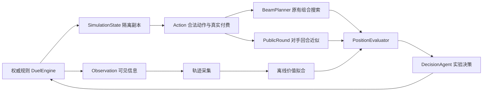

# 蕾米 AI 初步重构与训练方案

本次建立的是可复用、可采样、可对照的决策与训练基础。规则仍由 Godot 的 `duel_engine.gd` 执行；默认蕾米 AI 继续使用已有战术和斩杀搜索。实验评分器与完整公开回合模拟可单独运行，尚未通过胜率门槛，不默认替换原策略。

## 开源参考与采用边界

| 项目 | 参考内容 | 本项目的具体落点 |
| --- | --- | --- |
| [OpenSpiel](https://github.com/google-deepmind/open_spiel) | [游戏、状态、动作与观察接口](https://github.com/google-deepmind/open_spiel/blob/master/docs/api_reference.md)；[IS-MCTS 的信息集搜索实现](https://github.com/google-deepmind/open_spiel/blob/master/open_spiel/python/algorithms/ismcts.py) | 分离观察、合法动作、状态复制与评估；模拟隔离隐藏身份；为后续信息集重采样预留边界 |
| [RLCard](https://github.com/datamllab/rlcard) | [环境接口、轨迹与智能体分离](https://github.com/datamllab/rlcard/blob/master/rlcard/envs/env.py) | 无界面对局采样、按种子隔离验证、终局标签、版本化参数文件与独立 arena |

这些是架构和流程参考。本次使用原生 GDScript 和 Python 标准库编写适配层，没有复制第三方算法代码、安装上述项目或导入其模型。OpenSpiel 为 Apache-2.0，RLCard 为 MIT；未来若实际移植代码，需要保留相应许可证和版权声明。目前没有实现完整 IS-MCTS、CFR、PPO 或 AlphaZero，也没有将牌局错误建模为完全信息棋类。

## 已落地的代码边界



| 文件 | 当前职责 |
| --- | --- |
| `scripts/ai/observation.gd` | 输出己方手牌和双方公开区域、手牌数量；明牌手牌记忆须通过 UID 与 epoch 检验；不输出任一牌库顺序 |
| `scripts/ai/simulation_state.gd` | 使用现有图编码器保留自机与战场卡牌的共享引用；保留死亡恢复等战术记忆；清除旧路线、日志和缓存；屏蔽未知手牌与牌库身份 |
| `scripts/ai/action.gd` | 共用 cast、attack、pass、possession 动作表示，交由引擎校验并实际支付；主阶段候选包含留费/过牌 |
| `scripts/ai/beam_planner.gd` | 提取原有宽度 4、深度 3、350 ms 的灌伤候选搜索，仍通过蕾米战术回调处理组合和约束 |
| `scripts/ai/position_evaluator.gd` | 兼容旧灌伤评分；另提供 9 项可导出的特征、终局优先评分和有格式校验的参数载入 |
| `scripts/ai/public_round.gd` | 经真实阶段、触发、战斗和自机返回推进到下个己方主阶段；模拟公开自机与已知手牌；比较二重身合法群伤数量；允许保命牺牲阻挡 |
| `scripts/ai/decision_agent.gd` | 实验性逐动作评分，可选择完整公开回合端点；不完整分支不作为可靠结果，必要时退回旧策略 |
| `tools/ai/self_play.gd` | 先后手成对采样；保存观察、特征、终局标签、决策延时、未完成状态与来源哈希；支持双方视角 |
| `tools/ai/train_value.py` | 对终局结果做正则化逻辑回归，生成运行时可加载的价值参数 |
| `tools/ai/compare_arena.py` | 对齐种子和先手、检查规则/卡组来源、分别统计胜负与未完成局、报告置信区间和延时 |
| `tools/ai/replay_probe.gd` | 对本次录像 T11、T15 的四条合法路线运行公开回合对照，输出特征和完成状态 |

状态副本隔离卡牌实例与 RNG；卡牌定义的嵌套内容仍以只读方式共享。新策略不得原地修改卡牌定义。此约定不等于语言层面的不可变保护。

本次不是把全部蕾米战术搬进通用引擎。目标、效果选择、凭依、预留神枪、自机保护与斩杀仍有专用逻辑；抽出的 beam 也仍依赖这些回调。后续可以逐步替换，不能声称已经彻底解耦。

## 对当前瓶颈的作用与限制

旧灌伤的 `pressure_next_round` 是己方下轮输出估算，未执行完整对手回合。本次保留它作为基线，新增独立的公开回合模型。后者能看到铺出的单位被群伤、颜色来源消失、自机无法续接等真实规则后果。

公开回合模型采用有界的贪心对手策略：每次比较最多 16 个主阶段候选，整个回合最多推进 160 步。未知手牌不可施放，未来未知抓牌和成长牌使用无颜色、无能力、不可施放的占位牌；不假定它们会成为有用的资源。因此这是一种条件情景推演，不是完整胜率预测，可能低估未知解牌，也可能低估未来颜色恢复。

当前实验决策主阶段最多考虑 24 个施放候选，另加入攻击与 pass；每张牌通常只提供一个战术目标，复杂效果仍沿用已有选择器。它还不是所有合法动作/目标/模式的穷举接口，也没有搜索多步出牌后再结束回合的通用策略树。完整回合实验只有步数上限，没有严格墙钟期限，复杂分支可能很慢，不宜直接作为默认交互策略。

9 项特征为生命差、战场数值差、手牌数差、自机在场、颜色条件、即时进攻灵力、可见进攻威胁、残血脆弱单位和可用资源。它们能支撑最小训练闭环，但不足以表达解牌交换、角色依赖、过渡计划、回收链、场地增伤与威胁顺序。拟合权重并不会自动产生人类大局观。

## 第一轮训练：先学习评价，再扩大搜索

1. **建立可靠基线。** 使用旧策略采集双方视角，记录同一卡组在先后手和不同随机种子下的胜负；之后增加灵梦、堇子、幽幽子等风格不同的对手。保持对手策略版本固定。
2. **拟合端点价值。** 每条轨迹按其视角给终局标签：胜 +1、负 -1、平 0。未结束的 action_limit/no_progress 不当成平局，也不参与价值训练。训练集必须同时有胜、负样本。
3. **隔离验证。** 同一种子的先后手对局、双方视角、相邻局面必须进入同一分组。默认将种子 ≥1000 保留为验证；若没有这些种子，保留最后一个种子。不能将高编号种子全部用于训练后又当作未见测试。
4. **控制长局偏差。** 拟合时按视角轨迹均衡权重，避免步数多的长局占据全部梯度。输出验证交叉熵、准确率、标签覆盖、来源哈希和实验标记。
5. **单独做对局评测。** 验证损失下降不是棋力证据。用未参与拟合的种子，与冻结基线对齐先后手、规则、双方卡组和对手版本再比较胜率、未完成率和延时。

这里的训练是终局监督价值拟合，不是强化学习策略训练。当前训练器只消费数值特征，不消费完整观察中的牌名；轨迹格式保留观察是为了后续状态编码、教师行为和回放诊断。

### 可复现入口

在仓库根目录执行 PowerShell。Python 路径可替换为本机的 Python 3：

```powershell
$gd = '.godot-toolchain/editor/Godot_v4.7.2-stable_win64_console.exe'
$py = 'C:\Users\Lenovo\.cache\codex-runtimes\codex-primary-runtime\dependencies\python\python.exe'

# 采集基线双方视角，11 用于训练，1001 用于验证
& $gd --headless --path . --log-file work/ai-collect.log --script res://tools/ai/self_play.gd -- --mode=baseline --record-seats=both --seeds=11,1001 --output=res://work/ai-training/current-baseline.json
& $py tools/ai/train_value.py work/ai-training/current-baseline.json --output work/ai-training/smoke-weights.json --epochs 150

# 使用另外的种子评测；round=true 为较慢的完整公开回合实验
& $gd --headless --path . --log-file work/ai-candidate.log --script res://tools/ai/self_play.gd -- --mode=candidate --seeds=2001,2002 --weights=res://work/ai-training/smoke-weights.json --round=true --output=res://work/ai-training/candidate-test.json
& $gd --headless --path . --log-file work/ai-baseline.log --script res://tools/ai/self_play.gd -- --mode=baseline --seeds=2001,2002 --output=res://work/ai-training/baseline-test.json
& $py tools/ai/compare_arena.py work/ai-training/candidate-test.json work/ai-training/baseline-test.json --output work/ai-training/arena.json

# 固定录像路线探测及契约检查
& $gd --headless --path . --log-file work/ai-probe.log --script res://tools/ai/replay_probe.gd
& $gd --headless --path . --log-file work/ai-foundation.log --script res://tests/test_ai_foundation.gd
& $py tools/ai/test_train_value.py
& $py tools/ai/test_compare_arena.py
```

默认卡组是当前工作区的蕾米速攻文件 `deck/未命名卡组_7c906ca3ca80.mdeck`；更换对手使用 `--opponent=res://deck/实际卡组.mdeck`。训练种子、验证种子、最终 arena 种子应分别维护。种子固定了随机流程，但原策略存在墙钟预算，因此不同机器不保证搜索路线逐步相同。

实验现场开关是 `e.ai_memory[seat].decision_mode="public_round"`，参数放入同座位的 `value_weights`。该开关先保留当前已验证的即时斩杀，之后进入实验模型，遇到无法评估的分支退回旧策略；目前未添加界面开关。离线 runner 的 candidate 模式直接测试实验代理，主阶段行为不等同于这个保留斩杀优先的现场开关。

## 后续重构与训练顺序

人类牌手可通过设置开启回放训练模式，记录关键步骤点评、推荐路线与已验证下一步操作，导出独立 JSON；转换终局样本与偏好训练的操作见 [回放训练标注](回放训练标注.md)。文字不会自动成为可执行路线，完整行为策略学习仍属于后续阶段。

| 阶段 | 工作与验收 |
| --- | --- |
| 第二阶段：中盘表示与路线 | 增加颜色来源冗余、自机预计恢复时间、解牌费用预留、群伤后存活、增伤覆盖、手牌可实现伤害等特征；对“展开/留费/保色/清场/压血”生成 2–4 步完整路线；记录候选、被淘汰原因、端点评分与实际后果。先以 T11/T15、复活和清场局面验证，无非法动作和假斩杀 |
| 第三阶段：信息集搜索 | 对未知手牌与牌库从允许的卡组先验中采样；有证据时过滤分布；同一观察的信息集共享节点，避免每个隐藏世界采取互相矛盾的策略。借鉴 OpenSpiel IS-MCTS 的信息集边界，先做有界多情景搜索，再按实际收益增加复杂度 |
| 第四阶段：教师与策略学习 | 冻结强启发式和完整路线搜索作为教师，采集动作/目标/模式标签；以合法动作 mask 训练行为模型，并用终局和跨回合端点训练价值模型。先修复目标/效果枚举覆盖，再考虑 RLCard/OpenSpiel 环境适配与神经网络；不能用不完整动作集声称训练全策略 |
| 第五阶段：自博弈 | 与历史策略池、不同卡组、固定对手混合训练，防止只会镜像；对公共残局可做更深规则搜索与教师标注。暂不优先上 PPO 或大网络，先证明数据、评价和规划有效 |

建议的默认替换门槛：至少 100 个独立未见种子、每种先后手成对运行；分卡组报告结果；总胜率提升且置信区间支持提升；关键录像/自机保护/合法支付回归通过；未完成率不劣于基线；满足设备上的决策延时上限。先分开评测“新特征”“新权重”“对手回合”“多步路线”，再合并，避免无法定位退步来源。

更进一步是可行的：这次已提供状态、观察、动作、评分和采样边界，但提升棋力还需要完善动作覆盖、真实对手分布、路线搜索和评测数据。这些是下一步具体工作，不能由“换了架构”自动兑现。

实验实测与当前限制见 `work/ai-training/阶段一实验记录.md`。
